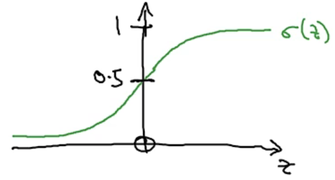
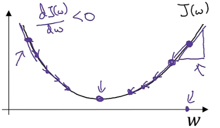
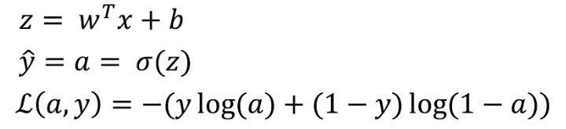
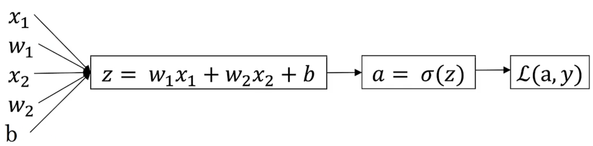
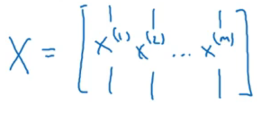

# Logistic 回归函数
### 回归函数
1.  已知x，求$\hat{y}=P(y=1|x) $,其中$ x\in\Bbb{R^{n_{x}}}$
    1.   计算法得到的是输入x后的结果为y=1的概率，而x是一个$n_{x}$维度的向量
2.  因此回归方程为$\hat{y}=\sigma(w^{T}x+b)$
    1.  其中$\sigma(z)=\frac{1}{1+e^{-z}}$
   <font color=green>
    2.  当$z \to + \infty, e^{-z} \to 0 \Rightarrow \sigma(z) \to 1$
    3.  当$z \to - \infty, e^{-z} \to + \infty \Rightarrow \sigma(z) \to 0$
   </font>


###回归函数的成本函数
1. 已知$\hat{y}=\sigma(w^{T}x+b),\sigma(z)=\frac{1}{1+e^{-z}}$,给出$\{(x^{(1)},y^{(1)}),(x^{(2)},y^{(2)}),...,(x^{(i)},y^{(i)})\}$,希望得到$\hat{y^{(i)}}\approx y^{(i)}$
    #### 损失函数 Loss（error）function
    1. Loss function: $L(\hat{y},y)=\frac{1}{2}(\hat{y}-y)^{2}$,但是这种平方的损失函数在后期优化的时候效果不好，因此不常用
    2. Loss function: $L(\hat{y},y)=-\displaystyle \left(y\log\hat{y}+(1-y)\log(1-\hat{y})\right)$
    <font color=green>
        1. 当y=1时：$L(\hat{y},1)=-\log\hat{y}$，若要求损失小则$\log\hat{y}$要大，而$\hat{y}$在[0,1]因此$\hat{y}\rightarrow 1$
        2. 当y=0时：$L(\hat{y},1)=-\log(1-\hat{y})$，若要求损失小则$\log(1-\hat{y})$要大，而$\hat{y}$在[0,1]因此$\hat{y}\rightarrow 0$
    </font>
    #### 成本函数 Cost function
    1.cost function: 
    $$
    \begin{aligned}
    J(w,b) &=\frac{1}{m} \displaystyle \sum_{i=1}^mL(\hat{y^{(i)}},y^{(i)})\\
    &=-\frac{1}{m} \displaystyle \sum_{i=1}^m \displaystyle \left[y^{(i)}\log\hat{y^{(i)}}+(1-y^{(i)})\log(1-\hat{y^{(i)}}) \right]
    \end{aligned}
    $$ 
>损失函数是针对单个训练样本来说的，而成本函数是针对算法来说的是多个训练集的损失

### 梯度下降法
1. 梯度下降法Gradient Descent:从初始值点开始，朝着最陡的方向，向下移动，即沿着下降最快的方向移动
2. 假如回归函数J(w,b)只考虑w参数时，应当重复操作
   $
   Reapeat\{\\
   \quad w:= w-\alpha \frac{dJ(w)}{dw}\\
   \}直到算法收敛
   $
   
3. 当考虑w和b参数时，应当重复操作
   $
   Reapeat\{\\
   \quad w:= w-\alpha \frac{dJ(w,b)}{dw}\\
   \quad b:= b-\alpha \frac{dJ(w,b)}{dw}\\
   \}直到算法收敛
   $
   >其中的$\alpha$是学习率，它决定了每次下降多少
   >$\frac{dJ(w,b)}{dw},\frac{dJ(w,b)}{dw}$是偏导数

### Logistic 回归中的梯度下降算法
1. 回归函数流程
   
   
   >回归函数中要做的就是改变参数w和b让这个损失L尽可能的小
   >梯度下降算法就是要计算出参数w和b应该如何变化，利用的是反向求导
    #### 单个样本
    1. 从后向前求导,先求出$\frac{dL(a,y)}{da}=-\frac{y}{a}+\frac{1-y}{1-a}$
    2. 求出$\frac{dL}{dz}$
        $
        \begin{aligned}
        \frac{dL}{dz} &= \frac{dL(a,y)}{da} \frac{da}{dz} \\
        &=\displaystyle \left(-\frac{y}{a}+\frac{1-y}{1-a}\right) \left[a(1-a)\right]\\
        &=a-y
        \end{aligned}
        $
    3. 计算$\frac{dL}{dw1},\frac{dL}{dw2},\frac{dL}{db}$得到三个参数的变化情况
        $
        \begin{cases}
        \frac{dL}{dw1} =\frac{dL}{dz}\frac{dz}{dw1}=x1(a-y)\\
        \frac{dL}{dw2} =\frac{dL}{dz}\frac{dz}{dw2}=x2(a-y)\\
        \frac{dL}{db} =\frac{dL}{dz}\frac{dz}{db}=a-y
        \end{cases}
        $
    #### m个样本
    1. 成本函数的变量：$a^{(i)}=\hat{y^{(i)}}=\sigma(z^{(i)})=\sigma(w^{T}x^{(i)}+b)$
    2. 成本函数$J(w,b)=\frac{1}{m}\displaystyle\sum_{i=1}^mL(a^{(i)},y^{(i)})$
    3. 成本函数的参数变化量：$\frac{\partial{J(w,b)}}{\partial{w1}}=\frac{1}{m}\displaystyle \sum_{i=1}^m\frac{\partial{L(a^{(i)},y^{(i)})}}{\partial{w1}}$
    4. 代码实现
   ```python
   //假设函数中只存在两个参数w1和w2，以及一个b
   //dw1和dw2都是用做累加器的，所以后面不需要带有i
   J = 0; dw1 = 0; dw2 = 0; db = 0;
   For i = 1 to m:
        z[i] = wx[i] + b;
        a[i] = sigma(a[i]);
        J += -[y[i] * loga[i] + (1-y[i]) * log(1-a[i])]
        dz[i] = a[i] - y[i];
        dw1 += x1[i]dz[i];
        dw2 += x2[i]dz[i]; //如果函数含有多个参数这里需要有一个for循环对每一个参数都进行遍历
        db += dz[i];
    J /= m; //求取的是平均值
    dw1 /= m; dw2 /= m; db /= m;

    //上面的代码是一次梯度下降的循环，在算法中需要重复上述代码多次从而得到合适参数。
    w1 = w1 - alpha * dw1;
    w2 = w1 - alpha * dw2;
    b = b- alpha * db; 
   ```

### 向量化
1. 向量化通常用于消除代码中的显示for循环，从而达到缩短时间的目的
2. 向量化的方法是使用numpy中的向量计算方法将for循环替换掉
   #### 向量化的Logistic回归函数
   1. 已知我们有一个训练样本集，这个X是一个(n_x,m)的矩阵，我们可以使用向量正向的计算出整个样本集的预测值A
   2. 由于$z^{(i)} = w^{T}x^{(i)}+b$，并且$w^{T}$是一个行向量，因此将$w^{T}$与X矩阵进行点乘后加上b（一个每个元素都是b的1*m的行向量）就可以得到Z这个(1,m)的行向量
   $$
   \begin{aligned} 
   Z &= \displaystyle\left[z^{(1)},z^{(2)}\cdots z^{(m)}\right] \\
   &= w^{T}X + \left[b,b,\cdots, b\right]
   \end{aligned}
   $$
   3. 由于$a^{(i)}=\sigma(z^{(i})) $,因此将
   $$
   \begin{aligned} 
   A &= \displaystyle\left[ a^{(1)},a^{(2)} \cdots,a^{(m)}\right] \\
   &= \sigma(Z)
   \end{aligned}
   $$
   4. 上述过程的代码表示就是
   ```python
   import numpy as np
   Z = np.dot(w.T,X)+b
   //np.dot表示两个向量的点乘
   //在Python中b是一个实数但是和向量相加的时候会自动扩展成一个（1，m）的向量，这个过程称为广播
   //w.T表示的是w的转置
   ```
   #### 向量化回归函数的梯度输出
   1. 根据上面梯度计算出的$dz=a-y$得到$dz^{(i)}=a^{(i)}-y^{(i)}$
   2. 之前向量化梯度函数的时候，已经将$a^{(i)}$定义为了A，而 $y^{(i)}$定义为了Y，因此$dZ=A-Y$
   3. 梯度变化中w和b的变换分别表示为$dw=\frac{1}{m}XdZ^{T}$,$db=\frac{1}{m}\displaystyle\sum_{i=1}^mdZ$
   4. 变化后的w和b为$w:=w-\alpha dw,b:=b-\alpha db$
   5. 上述过程的代码就是
   ```python
   Z = np.dot(w.T,X) + b
   A = sigmod(Z)
   dZ = A - Y
   dW = 1 / m * np.dot(Xm dZ.T)
   db = 1 / m * np.sum(dZ) 

   w := w - alpha * dw
   b := b - alpha * db  
   ```
   >向量化可以帮助减少每一次梯度变化中对于m个样本进行计算的for循环，来达到提高效率的目的
   >但是，向量化并不能够消除进行多次梯度变化所需要进行的for循环


   